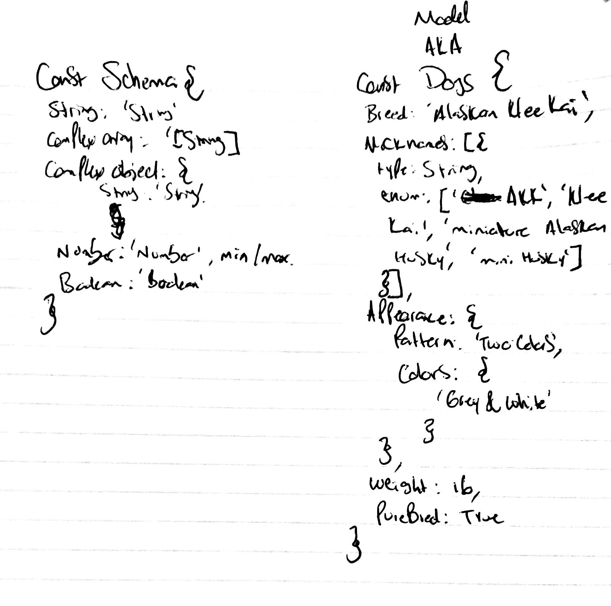
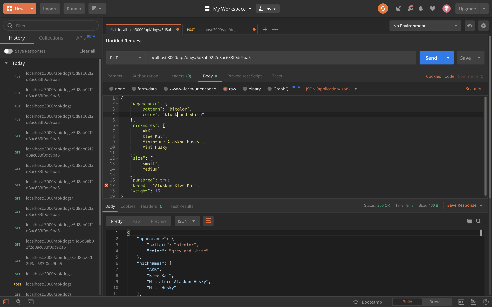
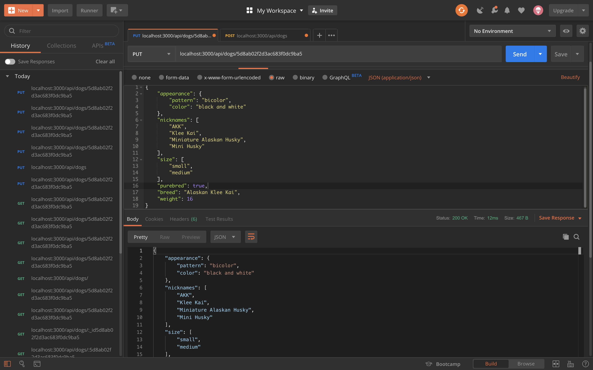
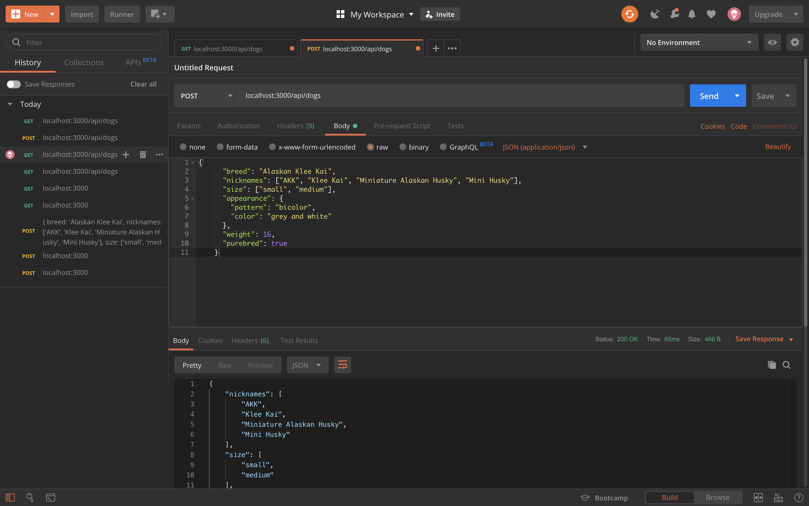
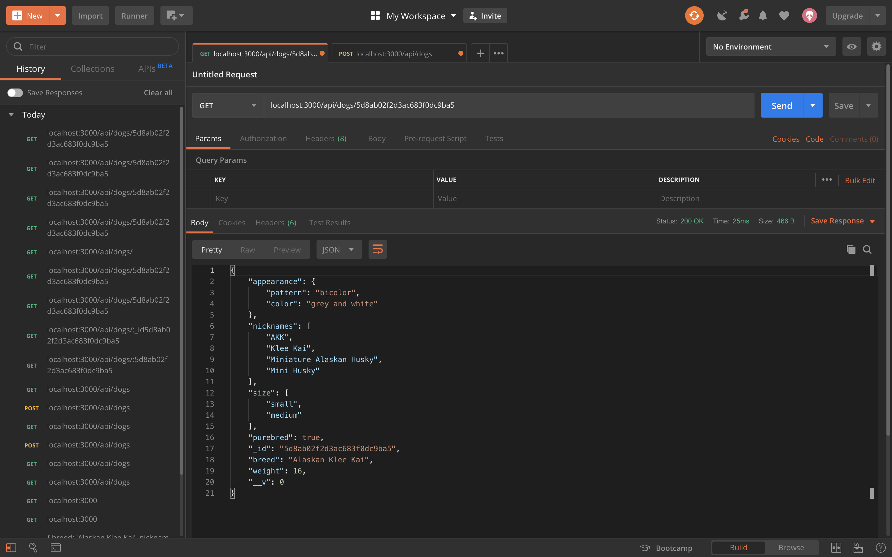
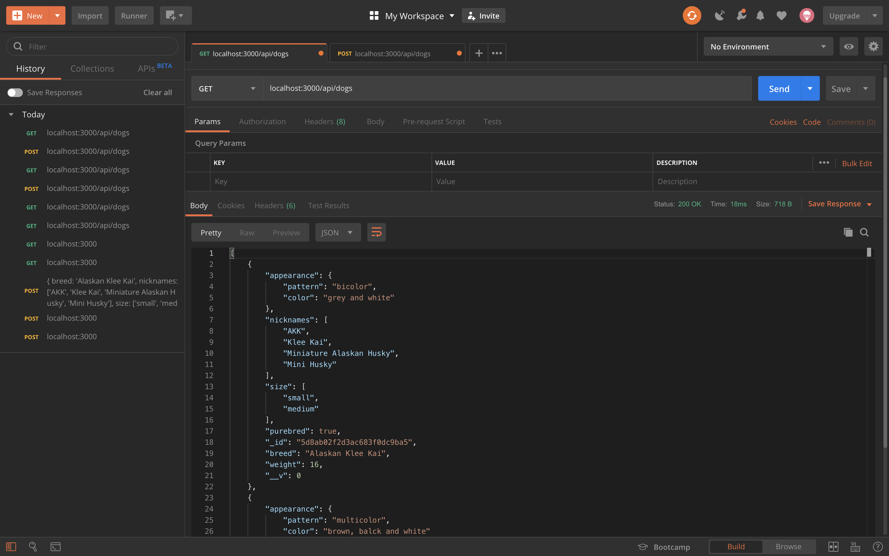
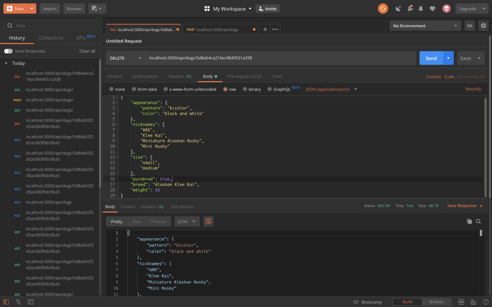
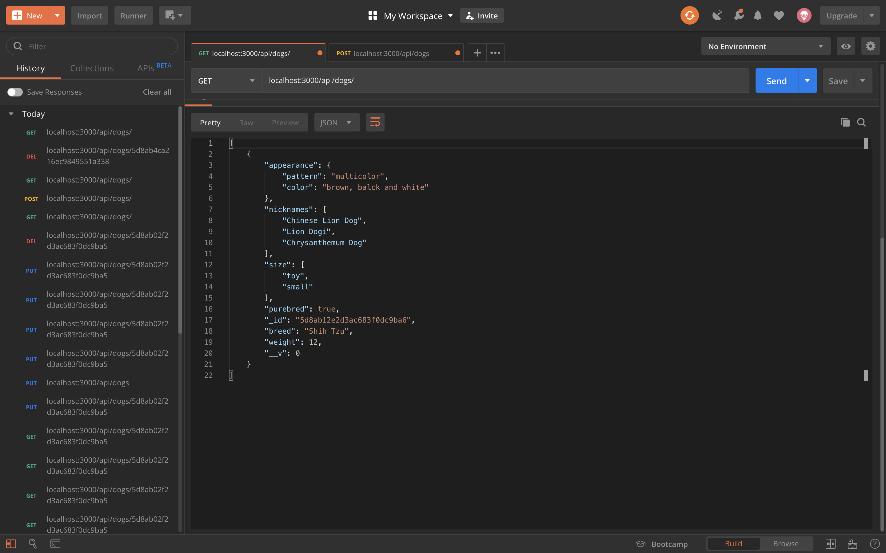

# lab-04

## Mongoose ORM

### Author: Antonella Gutierrez

### Links and Resources 

* [submission PR](https://github.com/antonella-401-advanced-javascript/lab-05/pull/1)
* [travis](https://travis-ci.com/antonella-401-advanced-javascript/lab-05)

### Documentation
* [jsdoc](/docs/) (Server assignments)

### Modules
##### Exported Values and Methods

##### Schema
Design a schema and use at least one:

1. `String`, `Number`, and `Boolean` property.
1. complex Array property
1. complex Object property
1. `default` option
1. `enum` option
1. min or max on string or number

##### Express Server

Create an express server with the following routes and associated model methods:

method | route | model method
---|---|---
`GET` | `/api/things` | Model.find
`GET` | `/api/things/:id` | Model.findById
`POST` | `/api/things` | Model.create
`PUT` | `/api/things/:id` | Model.findByIdAndUpdate
`DELETE` | `/api/things/:id` | Model.findByIdAndRemove

### Setup
#### `.env` requirements
* `PORT` - Port Number

#### Running the app
* `npm start`
* Endpoint: `/`
    * Returns a boolean
* Endpoint: `/docs`
    * Returns JSDoc documentation pages

#### Tests
* Unit Tests: `npm test`
* Lint Tests: `npm run lint`

#### Whiteboard

